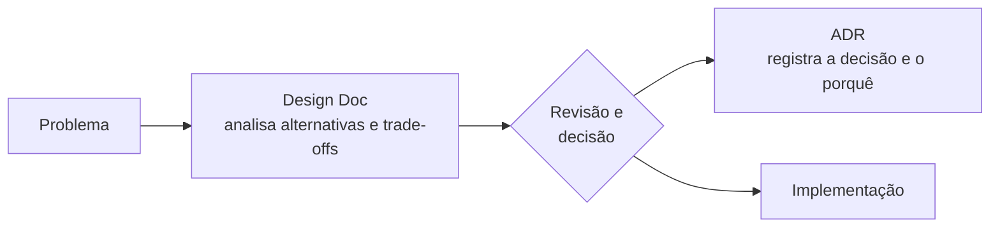

# Fundamentos de Arquitetura de Software

Guia de referência rápida sobre como **tomar, registrar e comunicar decisões arquiteturais**: níveis de decisão, características arquiteturais, trade-offs, estilos e padrões, C4 Model, Design Docs e ADRs.

> [!NOTE]
> Síntese pessoal, escrita com minhas palavras, de conceitos consolidados na literatura de arquitetura de software. As fontes estão nas [referências](#referências).

## Em resumo

- **Arquitetura é tomada de decisão.** Reúne as escolhas que determinam como um sistema atende aos requisitos funcionais e às características de qualidade exigidas pelo negócio.
- **Nem toda decisão é arquitetural.** É arquitetural a decisão que afeta objetivos de negócio, características de qualidade ou restrições relevantes — em geral, a que é cara de mudar depois.
- **Tudo é trade-off.** Nenhum sistema maximiza todas as características; cada escolha troca uma qualidade por outra.
- **O porquê importa mais que o como.** Sem o registro do contexto e da justificativa, decisões se tornam inexplicáveis com o tempo.
- **Design Docs antes, ADRs depois.** O primeiro apoia a análise de alternativas; o segundo preserva a decisão tomada.

## 1. Níveis de decisão

> "Toda arquitetura é design, mas nem todo design é arquitetura." — Grady Booch

| Nível | Pergunta central | Exemplo: plataforma de venda de ingressos |
|---|---|---|
| Arquitetura de solução | Como o sistema se integra ao ecossistema de TI e ao negócio? | Gateways de pagamento (cartão e PIX), antifraude de terceiros, conformidade com a LGPD, custos |
| Arquitetura de software | Como o sistema se estrutura internamente? | Serviços de eventos, reservas e pagamentos; monolito modular ou microsserviços; banco relacional para o estoque de assentos |
| Design de software | Como cada componente se organiza por dentro? | Arquitetura hexagonal; Repository para a persistência; Strategy para regras de preço (meia-entrada, lotes) |
| Design de código | Como cada trecho é escrito? | SOLID, Clean Code, convenções de nomes, refatoração contínua |

Quanto mais alto o nível, maiores o impacto e o custo de mudança — e maior a necessidade de explicitar trade-offs e registrar a decisão.

## 2. Características arquiteturais

São os requisitos não funcionais que influenciam a estrutura do sistema — as *"-ilities"*. Agrupadas aqui em uma classificação inspirada em Richards e Ford:

| Grupo | Exemplos |
|---|---|
| Operacionais | Disponibilidade, confiabilidade, desempenho, escalabilidade, elasticidade, tolerância a falhas, recuperabilidade, observabilidade |
| Estruturais | Manutenibilidade, extensibilidade, testabilidade, portabilidade, interoperabilidade, facilidade de deploy |
| Transversais | Segurança, privacidade, conformidade legal, usabilidade |

O objetivo não é maximizar todas, e sim identificar **as poucas que são críticas** para o negócio e torná-las mensuráveis — por exemplo, *p95 abaixo de 300 ms com 2 mil compras por segundo na abertura das vendas*.

## 3. As duas leis da arquitetura de software

Formuladas por Mark Richards e Neal Ford em *Fundamentals of Software Architecture*:

1. **Tudo em arquitetura de software é um trade-off.** Corolário: se uma decisão parece não ter trade-off, ele apenas ainda não foi identificado.
2. **O porquê é mais importante que o como.** Um diagrama mostra como o sistema é; só o registro da decisão explica por que ele é assim.

| Opção | Ganha | Abre mão de |
|---|---|---|
| Monolito | Simplicidade de desenvolvimento, de deploy e de transações | Escala e deploy independentes por parte do sistema; o acoplamento tende a crescer |
| Microsserviços | Deploy, escala e evolução independentes por serviço | Simplicidade operacional; consistência entre serviços; latência de rede |

## 4. Estilos, padrões arquiteturais e padrões de projeto

| Categoria | Escopo | Exemplos |
|---|---|---|
| Estilo arquitetural | Topologia do sistema inteiro: comunicação entre componentes, fluxo de dados, implantação | Cliente-servidor, monolito, microsserviços, orientado a eventos |
| Padrão arquitetural | Organização interna dentro de um estilo, sem ditar a implementação | Camadas, hexagonal (*ports and adapters*), Clean Architecture, CQRS |
| Padrão de projeto | Soluções no nível de classes e objetos | Catálogo GoF: Strategy, Factory Method, Observer |

## 5. Comunicar e registrar decisões

**Diagramas.** O C4 Model, de Simon Brown, organiza as visões em quatro níveis de zoom — **Contexto → Contêineres → Componentes → Código** —, e os dois primeiros costumam bastar para a maioria dos times. O diagrama de contexto é um bom ponto de partida, por explicitar integrações e dependências externas. Diagramas ad hoc também são válidos, desde que tenham título, rótulos, setas com direção, legenda, estilo consistente e apenas o essencial. Nas fases iniciais, esboços de baixa fidelidade evitam o apego a artefatos caros de produzir.

**Documentação.**



| | Design Doc | ADR (*Architecture Decision Record*) |
|---|---|---|
| **Quando** | Antes da implementação | Depois da decisão |
| **Objetivo** | Avaliar alternativas, trade-offs e riscos; alinhar o time | Registrar a decisão, o contexto e as consequências |
| **Formato** | Flexível, tão detalhado quanto o problema exigir | Curto, objetivo e versionado com o código |
| **Para se inspirar** | [JEPs do OpenJDK](https://openjdk.org/jeps/0), [designdocs.dev](https://www.designdocs.dev/library) | [Nygard (2011)](https://www.cognitect.com/blog/2011/11/15/documenting-architecture-decisions), [templates de ADR](https://github.com/architecture-decision-record/architecture-decision-record) |

<details>
<summary><strong>Template mínimo de ADR</strong></summary>

```markdown
# ADR-0001: <decisão em poucas palavras>

- Status: proposta | aceita | substituída por ADR-XXXX
- Data: AAAA-MM-DD
- Decisores: <nomes ou papéis>

## Contexto
Qual problema ou força motivou a decisão? Quais restrições existiam?

## Decisão
O que foi decidido e por quê.

## Alternativas consideradas
- Opção A: prós, contras e por que não foi escolhida.
- Opção B: ...

## Consequências
Benefícios, custos, riscos e o que passa a ser mais fácil ou mais difícil.
```

</details>

<details>
<summary><strong>Esqueleto de Design Doc</strong></summary>

```markdown
# <Título>

## Contexto e problema
## Objetivos (requisitos funcionais e não funcionais)
## Não objetivos
## Arquitetura proposta (diagramas e exemplos de código)
## Alternativas consideradas e trade-offs
## Impactos, riscos e questões em aberto
```

</details>

## 6. System Design

**System Design** é o processo de projetar um sistema considerando requisitos funcionais, características arquiteturais e trade-offs — a aplicação prática dos conceitos acima, cujos produtos são diagramas e Design Docs. **System Design Interview** é um formato de entrevista técnica que avalia essa habilidade, com problemas como projetar um encurtador de URLs ou um serviço de mensagens.

## 7. Exemplo aplicado: plataforma de venda de ingressos

A abertura das vendas de um grande evento concentra, em minutos, o tráfego de semanas — um bom cenário para observar características arquiteturais em tensão:

| Característica | Por que importa | Trade-off |
|---|---|---|
| Escalabilidade e elasticidade | Picos extremos na abertura das vendas | Capacidade elástica custa mais e exige automação e testes de carga |
| Confiabilidade | Um assento não pode ser vendido duas vezes | Controles fortes de concorrência reduzem a vazão; filas virtuais adicionam espera |
| Disponibilidade | Indisponibilidade na abertura significa receita perdida e desgaste de imagem | Redundância custa caro |
| Segurança | Pagamentos, dados pessoais (LGPD), robôs e cambistas | Antifraude e verificações adicionam atrito à compra |
| Interoperabilidade e tolerância a falhas | Dependência de gateways de pagamento e de antifraude externos | Timeouts, retentativas idempotentes e conciliação evitam cobranças duplicadas, mas complicam o fluxo |
| Observabilidade | Localizar em tempo real onde o funil de compra falha | Telemetria detalhada tem custo de coleta e armazenamento |

Nenhuma dessas escolhas é "a certa": cada uma troca uma característica por outra — e é exatamente isso que um ADR deve registrar.

## Referências

- Mark Richards e Neal Ford — *Fundamentals of Software Architecture* (O'Reilly, 2020); edição brasileira: *Fundamentos da Arquitetura de Software* (Alta Books, 2024)
- Erich Gamma, Richard Helm, Ralph Johnson e John Vlissides — *Design Patterns: Elements of Reusable Object-Oriented Software* (1994)
- Martin Fowler — [Software Architecture Guide](https://martinfowler.com/architecture/)
- Simon Brown — [C4 Model](https://c4model.com/)
- Michael Nygard — [Documenting Architecture Decisions](https://www.cognitect.com/blog/2011/11/15/documenting-architecture-decisions) (2011)
- Malte Ubl — [Design Docs at Google](https://www.industrialempathy.com/posts/design-docs-at-google/)
- [adr.github.io](https://adr.github.io/)
- ByteByteGo — [Scale From Zero To Millions Of Users](https://bytebytego.com/courses/system-design-interview/scale-from-zero-to-millions-of-users)

---

Notas de estudo de [@sidartaoss](https://github.com/sidartaoss). Correções e sugestões são bem-vindas via *issues* ou *pull requests*.
